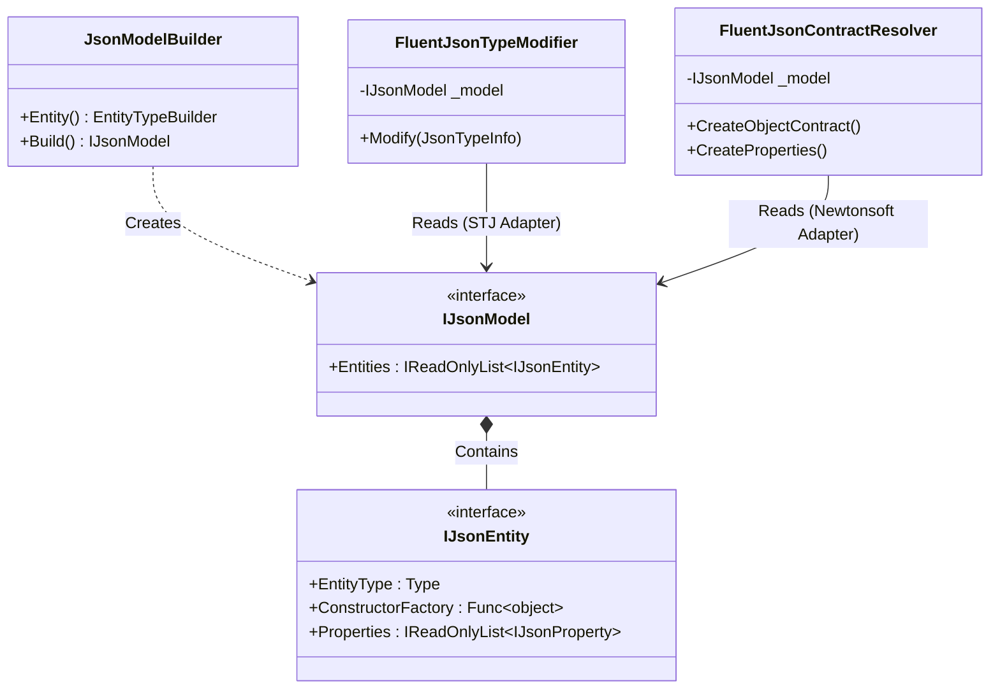

# The Agnostic Engine

The core philosophy of FluentJson is to completely divorce Domain-Driven Design constraints and mapping metadata from the underlying JSON serialization infrastructure. To achieve this, FluentJson employs a strictly enforced **Bridge Pattern**.

## The Bridge Pattern Architecture
`FluentJson.Core` acts as the single source of truth for the object graph mapping. It produces a rigid, immutable `IJsonModel`. This core library has **zero dependencies** on `System.Text.Json` or `Newtonsoft.Json`.

The adapter libraries (`FluentJson.SystemTextJson` and `FluentJson.Newtonsoft`) act as bridges. They read the agnostic `IJsonModel` and translate its rules into native extension points.

## Functional Parity Across Different Environments
A significant engineering challenge is maintaining **Functional Parity** between `System.Text.Json` (which uses a pipeline of modifiers and compiled converters) and `Newtonsoft.Json` (which relies on `IContractResolver` and reflection-based dynamic overriding).

### System.Text.Json Adapter
FluentJson leverages the `IJsonTypeInfoResolver` modifier pipeline added in .NET 7. When STJ inspects a type via `DefaultJsonTypeInfoResolver`, our `FluentJsonTypeModifier` intervenes:
- It overwrites `typeInfo.CreateObject` with our highly optimized `ConstructorFactory`.
- It prunes `typeInfo.Properties` according to the explicit mapping in `IJsonEntity`.
- It rewrites `Set` and `Get` delegates to bypass accessibility rules.

### Newtonsoft Adapter
The `FluentJsonContractResolver` inherits from `DefaultContractResolver`. It intercepts the reflection pipeline early:
- `CreateObjectContract` explicitly injects our pre-compiled `ConstructorFactory` overriding the `DefaultCreator`.
- `CreateProperties` maps fields missing from standard reflection sweeps and installs our `FluentJsonNwValueConverter` for structural flattening natively.

Because both adapters read from the exact same rigid `IJsonModel`, the serialization behavior is perfectly synchronized between the two varying JSON engines.
