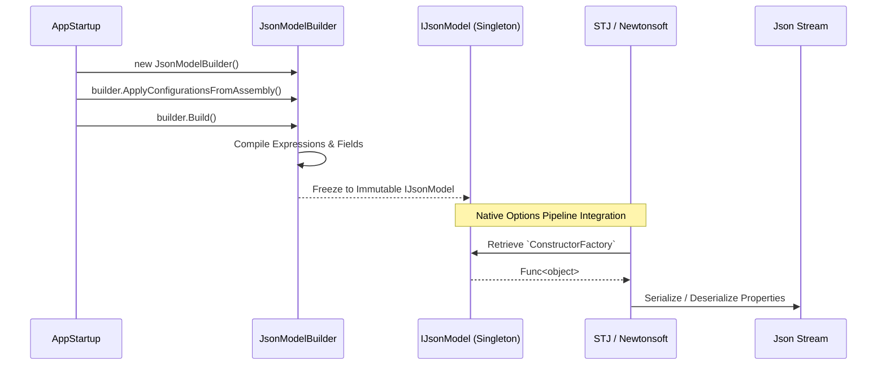

# The Metadata Model

The lifeblood of FluentJson is the `IJsonModel`. This rigid abstraction provides a cohesive map for all the underlying engine adapters.

## Immutability and the Freeze Pattern
The framework lifecycle comprises two distinct phases: Configuration and Execution.

1. **Configuration**: Developers construct rules using `JsonModelBuilder` and `EntityTypeBuilder<T>`. This phase is mutable, stateful, and intended entirely for application startup.
2. **Execution**: Upon invoking `.Build()`, the builder creates an `IJsonModel`.

The resulting `IJsonModel`, `IJsonEntity`, and `IJsonProperty` instances are deeply immutable. We call this the **Freeze Pattern**.
Why is freezing necessary? High-concurrency environments process thousands of serialization requests simultaneously. Using immutable mapping structures guarantees absolute thread safety during lookup phases without the immense overhead of `lock()` statements, reader-writer locks, or ConcurrentDictionaries during serialization mapping. 

## High-Concurrency Pre-compilation
During the final `Build` phase, heavy reflective operations are performed *exactly once*:
- Property/Field metadata lookups.
- Constructor and Conversion lambda compilation (`Expression.Compile`).
- Discriminator dictionary compilation.

The resulting metadata model is then injected statically into the DI container as a Singleton.

## Serialization Lifecycle

