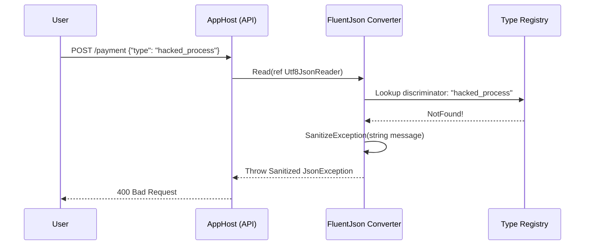

# Security by Design

The agility of JSON serialization engines historically introduced severe vulnerability vectors, particularly Remote Code Execution (RCE), Denial of Service (DoS), and information leakage.
FluentJson implements a strict Zero-Trust approach.

## 1. Protecting Against RCE (Polymorphic Injection)
Vulnerable serializers process abstract `$type` information blindly, allowing attackers to force the framework to instantiate arbitrary objects located in loaded assemblies—a classic vector for RCE.

FluentJson implements **Isolated Polymorphic Discovery**. We never scan assemblies globally based on the JSON payload. Derived types **must** be explicitly mapped using the `.HasDerivedType()` builder chain. Any unexpected discriminator value instantly crashes the pipeline, rendering typical polymorphic injection entirely impossible.

## 2. Denial of Service (Deep Nesting)
When parsing JSON, attackers can submit maliciously deeply nested objects (e.g., `{"a":{"a":{"a":...}}}`). To prevent Stack Overflow exceptions from crashing the application host, FluentJson perfectly honors the maximum depth constraints dictated by the underlying natively injected JSON options (e.g., `JsonSerializerOptions.MaxDepth`). It passes the engine depth checks cleanly, causing a highly efficient format exception rather than an infrastructure outage.

## 3. Sanitized Exception Policy
To safely operate in environments with centralized telemetry, logging platforms, or external API responses, our custom converters adhere to a **Sanitized Exception** policy.

Error messages generated internally regarding mismatching polymorphic instantiation, absent properties, or conversion faults are specifically scrubbed to prevent reflection-based metadata from leaking. Missing configuration exceptions will never expose internal class structures, internal assembly paths, or underlying private field names to standard response logs.

## Security Engine Flow

